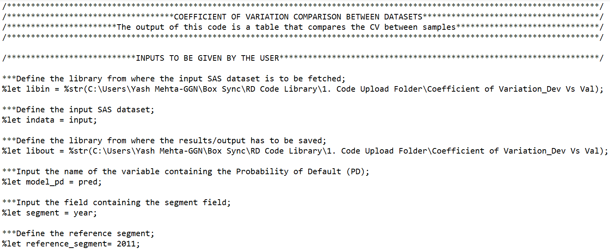

# Getting started with MEW

This README serves as a guide for getting started with MEW on Platform McKinsey.
___

## Overview

1. [What is MEW](#1-what-is-mew)
2. [Required before getting started](#2-required-before-getting-started)
3. [Tutorials](#3-tutorials)
4. [Additional help](#4-additional-help)
5. [Troubleshooting](#5-troubleshooting)


Appendix

* A1. [Helpful MEW commands](#Appendix-1-Helpful-MEW-commands)
* A2. [Helpful DVC commands](#Appendix-2-Helpful-DVC-commands)
* A3. [Helpful Conda commands](#Appendix-3-Conda-commands)
* A4. [Helpful UNIX commands](#Appendix-4-Helpful-UNIX-commands)
* A5. [Risk Dynamics coding standards](#Appendix-5-Risk-Dynamics-coding-standards)
* A6. [MEW expected folder structure](#Appendix-6-MEW-expected-folder-structure)

___
# 1. What is MEW? 

MEW (Model Excellence Workspace) is a platform that allows for efficient creation of model development and validation pipelines. 
<br>
MEW is an enabler of a digitization and automation journey to help depart from a fragmented workflow while leveraging your current environment. 
<br>

There are 4 primary benefits for using MEW:
1. Automation of E2E model lifecycle flow (including development and validation)
2. Documentation (Automated and versioned documentation using structured and modular templates)
3. Reproducibility (auditable and reproducible results, with industrial grade versioning tools (GitHub, DVC))
4. Reporting (ability to work with external reporting tools)

In plain terms, MEW is helpful due to its ability to provide consistency to your model development and validation activities and efficiency that comes with a standardized workflow. MEW is based on 2 version control systems (GitHub and DVC) that allows teams to collaborate in an efficient manner and quickly scale their projects. For each model, the code is stored on GitHub, while data is stored using DVC (see Appendix 2 on additional information on DVC). Luckily MEW makes it easy to coordinate which files go where by simply making the model executable via a pipeline or dvc.yaml file. 

# 2. Required before getting started
## 2a. Access to Platform McKinsey
You should have gotten access to a Platform McKinsey VM with MEW support by one or both methods:
1. You're granted access to a Platform McKinsey Team as part of a study and MEW is installed on one of the VMs. Working within such a VM you should follow team established protocols.
2. You're granted access to MEW's Platform McKinsey Team "MEW Sandbox". Here there are two VMs however only the "MEW Sandbox 1" VM is setup for users to do their work - contributing back to MEW and/or running through the tutorials and experimenting with MEW. You can  which has been setup for individuals to do their work contributing to MEW as well as individuals to test out MEW for themselves.

## 2b. Practicing Git Flow and access to OneFirm GitHub
MEW aligns with ModelOps and therefore users should practice [Git Flow](https://nvie.com/posts/a-successful-git-branching-model/). If you're working within a study your team should have already established how to handle repositories for your work. If you're just looking to get familiar with MEW or help contribute to its further development, you'll need a OneFirm GitHub account. [Learn more about OneFirm GitHub and setup an account](https://itdocs.intranet.mckinsey.com/display/OFG/One+Firm+GitHub).

When committing code back to GitHub as part of Git Flow you'll be asked for your password which is your *GitHub Personal Access Token*. To set one up follow the steps on GitHub help but remember to only set scope for the token to "repo" ([principle of least privilege](https://en.wikipedia.org/wiki/Principle_of_least_privilege)).


[GitHub steps on setting up a Personal Access Token](https://docs.github.com/en/github/authenticating-to-github/keeping-your-account-and-data-secure/creating-a-personal-access-token).

After completing the steps on GitHub help, select "Enable SSO" for the token for organization of OneFirm GitHub you choose to work with.

Once your access token is created, whenever you are prompted for your GitHub credentials, please use the following:

* Username = McKinsey email that is linked to your OneFirm GitHub
* Password = GitHub personal access token that you have created in this step

# 3. Tutorials
To get familiar with MEW we encourage you run through one or all of the tutorials.

1. [Clone and run an existing model](TUTORIAL_HELLO_WORLD.md)
2. [Starting a new project from scratch](TUTORIAL_START_NEW_PROJECT.md)


# 4. Additional help

MEW is built on various open source tools, the most important being DVC. Everyone should be encouraged to review the help material available at [dvc.org](https://dvc.org/doc/start) as you're able to execute all DVC commands via MEW.

## 4a. Set up your pipeline
For both model development and validation folders, you would need to setup pipelines of running both processes. For each, within "code" sub-folder of respective "development" and "validation" folders, you will have 2 types of files: .yaml files and Python code:
1. .yaml files
    * "dvc.yaml" file is an essential file that supports the MEW pipeline. This file indicates the steps of the pipeline ("stages"), their order, their dependencies/ inputs, and outputs. You can utilize a file in this model as your base, before developing more advanced models. Please see below for more information on how the "dvc.yaml" is structured.
    * "params.yaml" file is a file that stores all the parameters that are called in dvc.yaml and other code files, to have a central repository for parameter valus. This set up enables efficiency in the process, if any parameters need to be changed, as the edits will be done only in this file and will automatically flow through the rest of the code. For example, in the hello world model, one of the parameters is the % split between train and test datasets. If this parameter needs to be changed, only "params.yaml" would have to be updated.
2. Python code
    * For each pipeline stage identified in the "dvc.yaml" file, you would have a code file that runs the commands. For example, for the "data loading" phase in this model, there is a separate code file that runs the code to read in the data.


### Spotlight on the "dvc.yaml" file that defines the pipeline
This file is composed of steps, written down in the order they are to be run
In this model, there are 5 stages:
1. "data_loading": code to load the data in
2. "data_sampling": code to split up data into train and test datasets
3. "model_development": code to fit a linear regression model to data
4. "model_testing": code to check the model fit (e.g., output r_squared values)
5. "model_prediction": code to run the fitted model for prediction

You can create as many stages as you need, based on the model you are developing. The rule of thumb is to have a separate stage for each discrete step in the pipeline, to allow for faster de-bugging and faster model pipeline run time as stages that are not changed from previous run (if the pipeline is run multiple times) don't have to be run. For example, if you want to add to the basic steps above to perform data cleaning or variable engineering, you would add those steps as separate stages in the "dvc.yaml" file and create separate code files (Python or R) for them. 

For each stage, the syntax in the "dvc.yaml" file is as follows:

<em>
<b>stage_name (e.g., data_loading):</b><br>
    <b>cmd:</b> <br>
    - python3 code_file path_to_input_files (if needed by code_file) path_to_output_files ((if needed by code_file)<br>
    <b>deps:</b><br>
    - include code file to run this step (listed in cmd above as well)<br>
    - include any input files needed to run the code<br>
    <b>params:</b><br>
    - list relevant parameters from the params.yaml file needed to run this step of the code<br>
    <b>outs:</b><br>
    - include output files<br>
</em>

## 4b. Run all pipelines
```
dvc repro --all-pipelines -f
```
Please see Appendix 2 for additional DVC commands to run pipeline fully or only certain stages of the pipeline
<br>
"-f" parameter in the command above is optional. To be more efficient, you don't have to force all pipelines to be run; in that case, only the steps of the pipeline with changes based on previous run will be run.

## 4c. Create documentation
```
mew-cli documentation:create -p folder/path/to/docs.config.yaml
```


# 5. Troubleshooting

## 5a. Common Issues
1. Check your `docs.config.yaml` files are located in the correct directory
2. Check that all fields in the `docs.config.yaml` are inserted correctly. For example: `dir-order` rather than `dir_order`
3. Ensure your filepath references are correct
4. Assets are in the correct `/docs/assets` folder
5. Files and directories referenced in `dir_order`, `dir_details` and `file_order` all exist

## 5b. FAQs

1. Once, the folder structure and git is setup for a new project, how are ‘.yaml’ files set up? What are .yaml files and how are they created? 
* ‘.yaml’ files holds details on the pipelines and their corresponding dependencies. The typically used ‘.yaml’ files for mew include dvc.yaml (contains pipeline specifications) and params.yaml (contains parameter specifications). These have tobe created by the mew user by using a new text file i.e., ‘.txt’ file, and saving them as ‘.yaml’ files.
2.	How to resolve errors around unrecognized username/password while executing ‘ git push --set-upstream origin master’ step? 
* This error could be resolved by making sure that ‘Keep my email addresses private’ tab is unchecked in ‘https://github.com/settings/emails'.
3.	How DVC and Git interact with each other? 
* It is not preferred to save large data files (i.e., we may typically see that raw data files are large and hence DVC is used on raw data files in mew) in git. DVC is used to maintain proper version of data files. In other words, Git is used to keep track of codes whereas DVC is used keep track of raw data.
4.	What is dvc.lock? 
* dvc.lock file is generated by MEW when a pipeline has succesfully executed. It has the same stages as the dvc.yaml file but includes references to the data files that are on S3 (or at least they will be on S3 once `dvc push` is run after the pipeline has been executed.


---

# Appendix

# Appendix 1. Helpful MEW commands

1. Setup a new project (will create a new project folder in whichever directory you're current located)
```
mew-cli init
```

2. Create documentation (note: Path should be to directory where your top level docs.config.yaml file is located
```
mew-cli documentation:create -p development/models
```

3. Check MEW version
```
mew-cli -v
```

# Appendix 2. Helpful DVC commands

DVC (Data Version Control) is a version control tool for data versus code. MEW uses it to store and track data in the models, while utilizing GitHub for code storage.  
<br>
The main DVC files are as follows: <br>
1. dvc.yaml - pipeline file that define individual stages of the pipeline and how they are connected
2. .dvc files - placeholder files containing references to where the data is stored to be versioned in GitHub
3. .dvcignore files - files containing references to files that should be ignored by the DVC pipeline

<br>
Helpful DVC commands are listed below. <br>
1. Run all pipelines 
  * Run all pipelines
```
dvc repro --all-pipelines
```

  * Force run of all stages include -f
```
dvc repro --all-pipelines -f
```
2. Run individual pipeline (will also run dependent pipelines)
```
dvc repro path/to/pipeline/dvc.yaml
```
  * Can also navigate to directory and run simple repro command
```
dvc repro
```
3. Run a specific stage (will run also run dependent stages) (First, need to navigate to directory where dvc.yaml file is located)
```
cd <dir where dvc.yaml file is located>
dvc repro train-model
```
4. View dag (directed acyclic graph)
```
dvc dag (includes all pipelines within project)
q (to exit)
```
```
dvc dag path/to/select/dvc.yaml (will still display all connected pipelines)
```
5. Push and pull data to S3
  * Inform MEW/DVC to track a specific data folder (this will ensure that data files are not tracked in GitHub, especially large data files)
```
dvc add development/data/raw
```
  * Pull data for a project (process will read dvc.lock files to pull correct versions of data files)
```
dvc pull
```

6. Metrics [First you need to ensure that you have metrics defined in one or multiple stages of your dvc.yaml file(s)]
```
dvc metrics show
```

7. Plots [Fist you need to ensure that you have plots defined in one or multiple stages of your dvc.yaml file(s)]
```
dvc plots show
```
Running the command will produce an image of the plot in your project directory

8. Initialize DVC in a new repository. This process creates .dvc/.gitignore and .dvc/config files that would then be stored on GitHub. These files provide references to data storage versus storing actual data files. 

```
dvc init
```

9. To add data files to be tracked by DVC:
```
dvc add <file_location/name>
```

## <em> NOTE: Additional commands and/or command arguments can be found at dvc.org </em>

# Appendix 3. Conda commands

* Default environment can be updated by Platform McKinsey at any time, so best practice to create a new Conda virtual environment
```
conda create --name env_name
```

* List all available conda environments
```
conda env list
```

* Activate new or existing environment: 
```
conda activate env_name
```

* Clone an existing environment
```
conda create --clone env_name --name new_env_name
```

* Remove environment
```
conda env remove --name env_name
```

* List all packages installed in an environment:
```
conda list -n env_name
```

# Appendix 4. Helpful UNIX commands
* Remove a directory and files within recursively
```
rm -rf directory_name
```
* Make a directory
```
mkdir directory_name
```
* Copy a directory recursively
```
cp -R source_folder new_folder
```
* List files
```
ls (list)
ll (list files including hidden ones)
```


# Appendix 5. Risk Dynamics coding standards

## 1. General code structure
Codes should be written in a structured manner, to enhance the quality, clarity and development time. A logical flow of different code components is described below:
  * High-level code description
      * Purpose
      * Inputs
      * Outputs
  *	Detailed description and reasoning
      * Inputs - structure, source, key variables
      * Key components of the code
      * Techniques/functionalities used
      * Outputs - structure, key variables
  * Define libraries
  * Specify global input files with clear definition of working directories
  * Code components (functions, environment/local variables, datasets should be defined, described and reasoned at the beginning of relevant component in the form of comments)
  * Functions/routines and subroutines clearly identified and commented
  * Outputs and their interpretation clearly identified and commented

## 2. Visual appearance
Paying attention to code appearance is important to increase its readability. Key points below:
  * Space out characters and lines clearly
  * Ensure vertical alignment of different components of the code
  * Separate blocks of code into ‘paragraphs’ so that different sections are easily defined
  * Use indentation to show where control structures (if, else, while and other loops) begin and end, and where the code within them is


## 3. Commenting
Add comments/instructions to make the code as self-explanatory as possible. Commenting ensures the code is written as desired.
  * Specify input/output/intermediate datasets and variables
    
  * Explain different parts of the code (guidance on constructs, specifications, reasoning behind their use)
    
  * Add guidance on interpretation of test output/results
    

## 4. Naming convention
Dataset/variable naming conventions should be defined in order to maintain consistency throughout the code:
  * Use descriptive dataset/variable names and ensure these names describe the data that they’ll contain e.g. 'input_gdp_real' & 'input_essbase’
  * Standardize names of input/output/intermediate data files e.g. 'input' in case of single input file, 'output1_accuracy_nw' and 'output2_accuracty_ew' in case of two output files where ‘nw’ denotes number-weighted and ‘ew’ denotes exposure-weighted    
  * Simplify variable names e.g. client.brth.dt to date.of.birth or client.birth.date
  * Magic numbers (hard-coded values) should never be used as they are large source of errors and confusion. The numbers should be assigned to named constants and the name constants should be used instead


## 5. Re-usable / maintainable code
To increase re-usability of codes in different projects, or to ease updating codes over a long time:
  * Divide the code into two parts:
      * Generic functional specifications
      * Variable part that specifies the input dataset and variable names
  * Ideally, the generic function should remain unchanged and only the variable component should be modified while re-running the code
  * Such a structured code can be reused or updated quickly and can save a lot of time e.g. when libraries in R change, or when the input data type changes


## 6. Function documentation
Documentation of a function should include descriptive comments that can help a user run the program without reading any of the code.
  * Functions should contain a comments section immediately below the function definition line
  * The comments should include:
      * Brief description of the function
      * List of the function’s arguments, denoted by Args:, with a description of each (including the data type)
      * Description of the return value, denoted by Returns:


# Appendix 6. MEW expected folder structure

This is an example of what the folder structure should look like for a directory in order to generate documentation.

```

mew-cli-working-directory
  |
  +-- /documentation // When store the documentation outputs if in Top-Level Config does not provide "dir_output_path" value
  |
  +-- /models
  |   |
  |   +-- docs.config.yaml // Top-Level Config
  |   +-- /docs
  |   |   |
  |   |   +-- .md files for the Final Document
  |   |   +-- /assets
  |   |       |
  |   |       +-- /images
  |   |       +-- /css
  |   |       +-- /js
  |   |
  |   +-- /Test_Plan_Folder
  |       |
  |       +-- docs.config.yaml // Low-Level Config
  |       +-- /Statistical_Test_Folder
  |           |
  |           +-- /docs
  |               |
  |               +-- .md files for the Test
  |               +-- /assets
  |               |   |
  |               |   +-- Same structure as other assets folders
  |               |
  |               +-- ...other Statistical Test files (data, code, etc)
  |
  +-- /validations
  |   |
  |   +-- docs.config.yaml // Top-Level Config
  |   +-- /docs
  |   |   |
  |   |   +-- .md files for the Final Document
  |   |   +-- /assets
  |   |       |
  |   |       +-- /images
  |   |       +-- /css
  |   |       +-- /js
  |   |
  |   +-- /Test_Plan_Folder
  |       |
  |       +-- docs.config.yaml // Low-Level Config
  |       +-- /Statistical_Test_Folder
  |           |
  |           +-- /docs
  |               |
  |               +-- .md files for the Test
  |               +-- /assets
  |               |   |
  |               |   +-- Same structure as other assets folders
  |               |
  |               +-- ...other Statistical Test files (data, code, etc)
  |
  ...
```


### About /docs
Any `/docs` folder will use the following convention:
```
  |   +-- /docs
  |       |
  |       +-- .md files to be included in the generated document
  |       +-- /assets
  |           +-- /images
  |           +-- /css
  |           +-- /js

```

`/docs` is where the user should store their Markdown files and any corresponding supporting files
- Markdown files that require JSON to display data as a table will should have those JSON files stored here.
- Any files declared in `docs.config.yaml` will be read from the corresponding `/docs` folder.


`/docs/assets` contains folders to store additional files related to the documentation
- `/images` - Contains image files that will be displayed in the documentation
- `/css` - Contains CSS stylesheet files that can be applied to the generated HTML
- `/js` - Contains JavaScript files the user would like to execute within

---
